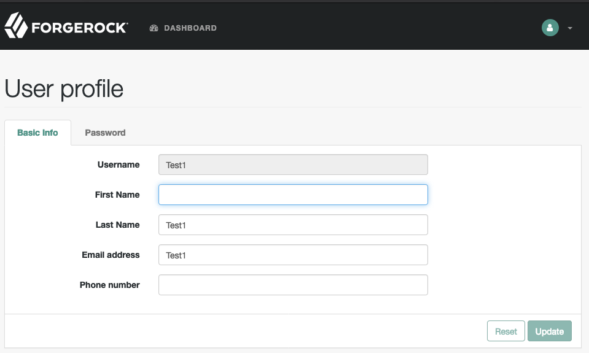

Overview
========

Thank you for your interest in Veridium and biometric authentication!

You can easily add strong, multi-factor, mobile biometric authentication when using SAML Federation as a ForgeRock Access Management user.

The VeridiumID authentication platfrom replaces pins and passwords with biometrics. Biometrics represent something you are, which is the strongest and most secure evidence that you are who you say you are. This independent authentication layer allows you the freedom to customize the user experience - choosing the best biometrics for your needs - from native (fingerprint of face) - to Veridium's proprietary 4 Fingers TouchlessID, or other 3rd party biometrics. This makes VeridiumID effective for presentation attack detection and strong multi-factor authentication.

VeridiumID installs easily in your network to provide high assurance
authentication decisions wherever they are needed. From physical access to
website and sensitive server access, to websites and specific use cases like high value financial transactions,
VeridiumID provides the strongest level of authentication assurance with biometrics.

As a ForgeRock Access Management user, you can now add biometric authentication into your authentication flows using a SAML Federation.

Before you begin
================

In order to complete this evaluation, you will first need to contact Veridium to
provision the IdP side of the Federation and then simply download a mobile app for the biometric
enrolment and authentication. Please contact us at <info@veridiumid.com> to get
started or for more information.
 [http://bk:8080/openam/XUI/ -
    login/&service=VeridiumChain](http://openam.partner.com:8080/openam/XUI/#login/&service=VeridiumChain)

Prerequisites
=============

-   You are familiar with ForgeRock Federation concepts and have access to the
    AM SAML v2.0 Guide -
    <https://backstage.forgerock.com/docs/am/6/saml2-guide/#saml2-configure-remote-idp>.
    The procedure steps reference relevant sections of this guide.

-   A working ForgeRock OpenAM instance.

-   You have engaged Veridium and have received the POC metadata file and have downloaded the appropriate Android or iOS authenticator mobile app.

Enabling the OpenAM/VeridiumID SAML Federation
==============================================

This section will guide you through creating a federation with your OpenAM
instance taking the SP Role and VeridiumID taking the IdP role.

Create Hosted Service Provider
------------------------------

The following procedure provides steps for creating a hosted service provider by
using the Create Hosted Service Provider wizard. Afterwards, you will edit the
Service Provider configuration to match the VeridiumID partnership settings.

### Creating a Hosted Service Provider (Procedure 2.3.2)

1.  Under *Realms* \> *Realm Name* \> *Dashboard* \> *Configure SAMLv2
    Provider*, click *Create Hosted Service Provider*.

2.  Unless you already have metadata for the provider, accept the Name for this
    service provider in the field provided, or provide your own unique
    identifier.

>   The default name is the URL to the current server which hosts the service
>   provider, and the default MetaAlias is sp.

### Note

>   Ensure the MetaAlias is unique for each provider in a CoT and in the realm.
>   If you need to create a service provider with a different MetaAlias,
>   navigate to *Realms* \> *Realm Name* \> *Applications* \> *Federation* \>
>   *Entity Providers*, and select *New* in the Entity Providers table.

3.  Either add the provider to the circle of trust you have already created, or
    select the *Add to new* option and provide a New Circle of Trust name.

4.  (Optional) If this SP requires a different attribute mapping
    configuration than the default IdP attribute mapping, set the mapping in the
    Attribute Mapping section. Map identity provider attribute names in the Name
    in Assertion column to user profile names from your identity repository in
    the Local Attribute Name column.

5.  Click *Configure* to save your configuration and click “*No*” to “*Configure
    Remote Identity Partner*”.

### Configure Service Provider for dynamic profile creation

If you want to use dynamic profile creation with auto-federation to create federated
identities, follow the steps below.

1.  Navigate to *Configure* \> *Authentication* \> *Core Attributes \> User
    Profile*

2.  Set *User Profile* to *Dynamic* and *Alias Search Attribute Name* to *uid*,
    then click *Save Changes*.

3.  Navigate to *Realms* \> *Realm Name* \> *Applications* \> *Federation* \>
    *Entity Providers* \> \<*Service*\_*Provider*\_*Name\>* \> *Assertion
    Processing* \> *Auto Federation*.

4.  Configure as shown in the following screenshot.

5.  Next, click the *Services* tab. Scroll down to the *Assertion Consumer
    Service* section and edit the URLs from “Consumer” to “AuthConsumer”.

>   Note that you do not need to change the location for the PAOS service
>   because integrated mode does not support the PAOS binding.

6.  Click *Save* to save changes.

7.  Export the XML-based metadata from your service provider which will be
    shared with your Veridium IdP.

>   \$ curl \\  
>   --output metadata.xml \\  
>   "http://www.sp.example:8080/openam/saml2/jsp/exportmetadata.jsp?entityid=\\  
>   http://www.sp.example:8080/openam\&amp;realm=/mysubrealm"

When you have configured your provider in the Top Level Realm, you can omit the query string from the URL.
Alternatively, provide the URL to other providers so they can load the metadata.

Create Remote Identity Provider
------------------------------

In this section you will add VeridiumID as a Remote Identity Provider and add it
to the CoT created above for you SP. You will need the idp-metadata.xml file
from the VeridiumID server.

### Configuring a Remote Identity Provider (Procedure 2.3.3)

1.  Obtain the identity provider metadata file from you Veridium contact.

2.  Under *Realms* \> *Realm Name* \> *Dashboard* \> *Configure SAMLv2
    Provider*, click *Configure Remote Identity Provider*.
    

3.  Upload the identity provider metadata file i.e.
    *veridiumid-idp-metadata.xml*.  
    The remote identity provider's metadata might contain more than one
    KeyDescriptor element. If it does, the hosted AM service provider will
    validate assertions from the identity provider against certificates with key
    descriptors with an appropriate use attribute. Incoming assertions that
    cannot be validated against any of the certificates will be rejected by the
    hosted service provider.  
    **Note**  
    Ensure the MetaAlias is unique for each provider configured in a CoT and in
    the realm.
    

4.  Either add the provider to the circle of trust you already created, or
    select *Add to new* and provide a New Circle of Trust name.

5.  Click *Configure* to save your configuration.

Configure the biometric authentication flow
-------------------------------------------

In this section you will create a new SAML2 authentication module and an
authentication chain to redirect authentication to VeridiumID.

### Create SAML2 Authentication module

1.  Navigate to *Realms* \> *Realm Name* \> *Authentication* \> *Modules*, then
    click *Add Module*.

2.  Specify a name [example: VeridiumMod] for the module and specify the module
    type as *SAML2*.

3.  Click *Create*.

4.  Configure the SAML2 authentication module options:

    -   Add "IdP Entity ID" (provided by Veridium).

    -   Set Request Binding to *HTTP-Redirect*.

    -   Set Response Binding to *HTTP-POST*.

    -   Set NameID Format to
        *urn:oasis:names:tc:SAML:1.1:nameid-format:emailAddress*.

5.  Click *Save Changes*.

### Create Authentication Chain

1.  Navigate to *Realms* \> *Realm Name* \> *Authentication* \> *Chains*, click
    *Add Chain*.

2.  Specify a name [example: VeridiumChain] for the chain and click *Create*.

3.  Click *Add a Module*.

4.  In the *New Module* dialog:

    -   Under *Select Module*, select the module created above.

    -   Under *Select Criteria*, select *Required*.

5.  Click *OK* and then *Save Changes*.

Test SAML2 configuration
----------------------------

In this section you will test your configuration by logging in to the AM console
as a user to view that user’s profile. You will be redirected to the Veridium
IdP for a passwordless authentication using your mobile device and your
biometrics.

### Install the VeridiumID Mobile App

1.  Download VeridiumID mobile app from the Apple or Google Play App Store:

2.  Open VeridiumID, allow any requested permissions.

3.  The app will open to the start page.

4.  Tap SCAN QR CODE.

5.  Scan the QR code sent by your Veridium contact.

6.  Follow the prompts to complete enrollment.

### Perform passwordless login

1.  Clear your browser's cache and cookies.

2.  Login into the user’s profile using a URL that references the authentication
    chain with SAML2 module that you created above. For example,
    [http://openam.partner.com:8080/openam/XUI/ -
    login/&service=VeridiumChain](http://openam.partner.com:8080/openam/XUI/#login/&service=VeridiumChain)

If configured correctly, AM will redirect you to the Veridium identity provider
for authentication. You will be presented with a page similar to the below:

3.  In the VeridiumID Authenticator app, tap your profile to open a QR code
    scanner.

4.  Scan the QR code and then present your biometrics.

5.  AM should now give you access to the user’s profile page.

What’s Next?
------------

For assistance or more information, please contact us at info\@veridiumid.com.
